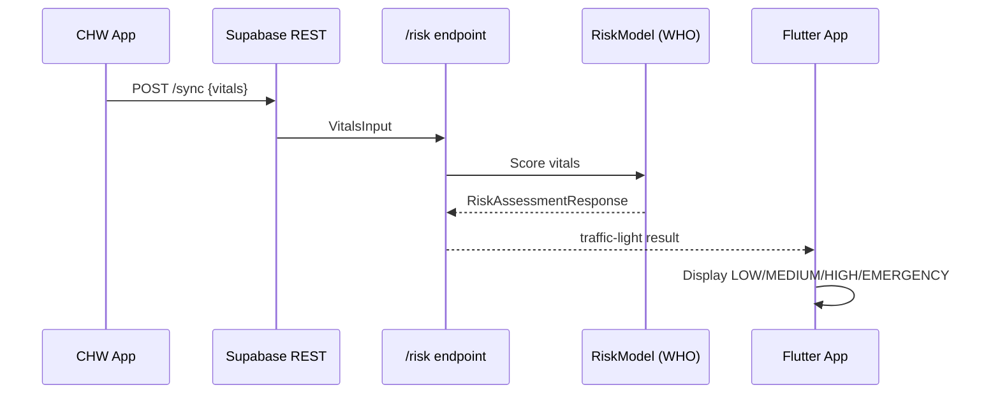
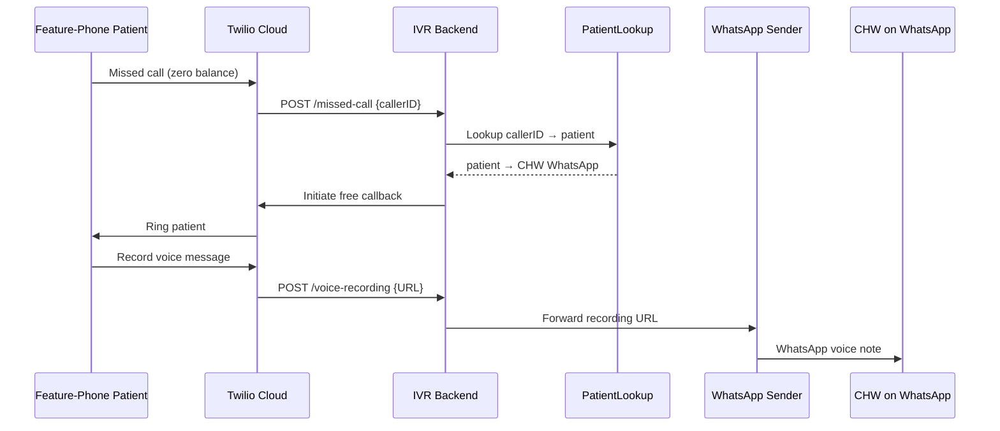
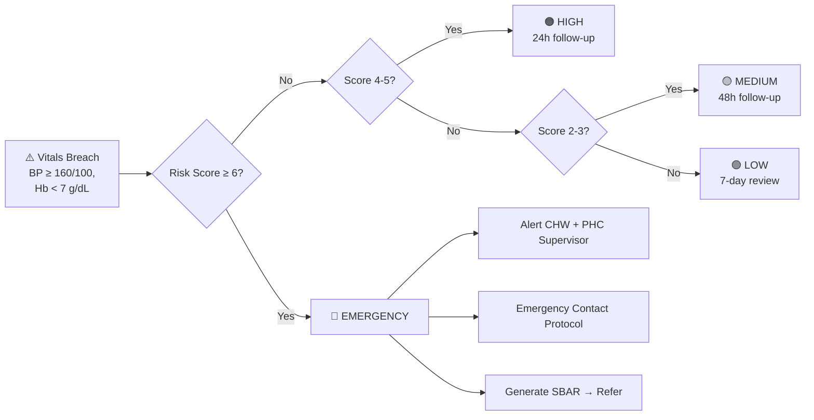
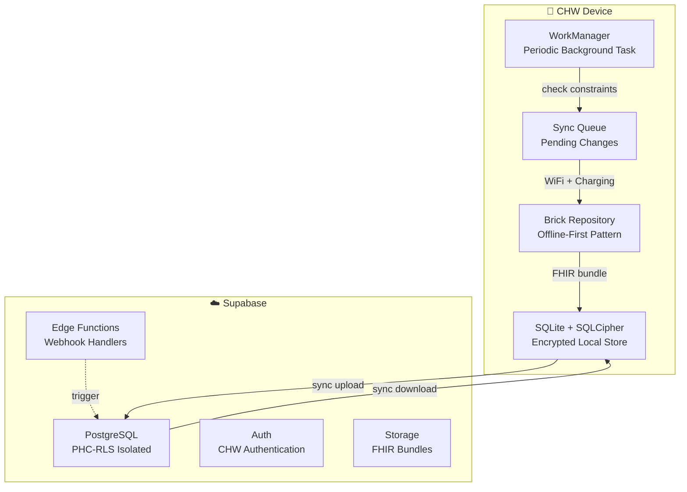

# O2 Platform — Architecture Diagrams

> Updated after Phase 1 implementation and 9-diagram-correction pass.

---

## System Architecture

```mermaid
flowchart TB
    subgraph FlutterApp["📱 Flutter CHW App"]
        subgraph FlutterCore["Core Layer"]
            BRICK["Brick ORM<br/>Offline-First Repository"]
            SQLCipher["SQLCipher<br/>AES-256 Encrypted DB"]
            AndroidKeyStore["Android Keystore<br/>Hardware-Backed Key Storage"]
            WorkManager["WorkManager<br/>WiFi + Charging Sync"]
            FHIRSerializer["FHIR Serializer<br/>R4 ↔ O2 Models"]
        end

        subgraph FlutterServices["Service Layer"]
            SyncEngine["Sync Engine<br/>Conflict Resolution + Retry"]
            PatientLookup["Patient Lookup<br/>Caller ID → Patient Record"]
            RiskEngine["Risk Engine<br/>Traffic-Light Triage"]
            EmergencyAlert["Emergency Alert<br/>HIGH/EMERGENCY → PHC Supervisor"]
            ABDMService["ABDM Service<br/>ABHA Mod 97 Validation"]
            VoiceWidget["Voice Widget<br/>Bhashini STT/TTS Stubs"]
        end

        subgraph FlutterModels["FHIR R4 Models"]
            Patient["Patient Resource"]
            Observation["Observation Resource<br/>(Vitals)"]
            DocumentRef["DocumentReference<br/>(SBAR)"]
        end

        SQLCipher -->|encryption key| AndroidKeyStore
        BRICK -->|local SQLite| SQLCipher
        WorkManager -->|sync task| SyncEngine
        SyncEngine -->|sync config| BRICK
        FHIRSerializer -->|serialize/deserialize| Patient
        FHIRSerializer -->|serialize/deserialize| Observation
        FHIRSerializer -->|serialize/deserialize| DocumentRef
    end

    subgraph APIGateway["🌐 API Gateway / Supabase"]
        Supabase["Supabase PostgreSQL<br/>PHC-Based RLS Isolation"]
        REST["REST API<br/>FHIR-Compliant Endpoints"]
        Realtime["Realtime Subscriptions<br/>Push Notifications"]
        
        SyncEngine -->|POST /sync| REST
        REST -->|sync trigger| SyncEngine
        Supabase -.->|data sync| REST
    end

    subgraph AIServer["🤖 AI Server (FastAPI)"]
        RISK["POST /risk<br/>Traffic-Light Triage"]
        SBAR["POST /sbar<br/>LLM Clinical Summary"]
        RiskModel["Risk Model Service<br/>WHO Thresholds Rule Engine"]
        SBARLLM["SBAR LLM Service<br/>OpenAI/Anthropic JSON Schema"]
        
        RISK -->|scoring| RiskModel
        SBAR -->|generation| SBARLLM
        RISK -.->|FHIR Observation| SBAR
    end

    subgraph IVRBackend["📞 IVR Backend (FastAPI)"]
        MissedCall["POST /twilio/missed-call<br/>Caller ID Webhook"]
        VoiceRec["POST /twilio/voice-recording<br/>Recording URL Webhook"]
        PatientLookupService["Patient Lookup Service<br/>CLI → Patient → CHW Mapping"]
        WhatsAppSender["WhatsApp Sender<br/>Voice Note to CHW"]
        EmergencyDetector["Emergency Detector<br/>EN/KN/HI Keyword Scan"]
        TwilioControl["Twilio Control<br/>Callbacks + Recordings"]
        
        MissedCall -->|CLI lookup| PatientLookupService
        VoiceRec -->|recording URL| WhatsAppSender
        PatientLookupService -->|CHW number| WhatsAppSender
        EmergencyDetector -->|alert trigger| EmergencyAlert
        TwilioControl -.->|missed call signal| MissedCall
        TwilioControl -.->|recording ready| VoiceRec
    end

    subgraph External["🔗 External Integrations"]
        Twilio["Twilio Cloud<br/>Voice + WhatsApp API"]
        WhatsApp["WhatsApp Business API<br/>Voice Notes to CHW"]
        Bhashini["Bhashini API<br/>STT + TTS (Phase 2)"]
        ABDMNHA["ABDM NHA API<br/>HPR/HFR (Phase 2)"]
        FHIRServer["FHIR R4 Server<br/>Health Information Highway"]
    end

    FlutterApp -->|sync when WiFi + charging| Supabase
    Supabase -->|FHIR bundle| AIServer
    AIServer -->|risk level + SBAR| FlutterApp
    FlutterApp -->|missed call| Twilio
    Twilio -->|callback| PatientLookupService
    WhatsAppSender -->|voice message| WhatsApp
    WhatsApp -->|voice note| WhatsAppSender
    VoiceWidget -.->|STT/TTS| Bhashini
    ABDMService -.->|HPR verify| ABDMNHA
    FHIRSerializer -.->|sync target| FHIRServer
```



---

## Risk Assessment Flow



---

## IVR Missed-Call Flow



---

## Emergency Triage Decision Tree



---

## Sync Architecture



---

## ABDM Integration Flow

```mermaid
flowchart TB
    A["ABHA Number Input<br/>XXXX-XXXX-XXXX-XX"] --> B{Mod 97 Checksum<br/>number % 97 == 1?}
    B -->|Invalid| C["❌ Invalid ABHA"]
    B -->|Valid| D["HPR Verification<br/>Health Professional Registry"]
    D -->|Verified| E["HFR Linking<br/>Health Facility Registry"]
    D -->|Not Found| F["⚠️ Manual Verification"]
    E --> G["ABDM Record Link<br/>Consented Access"]
