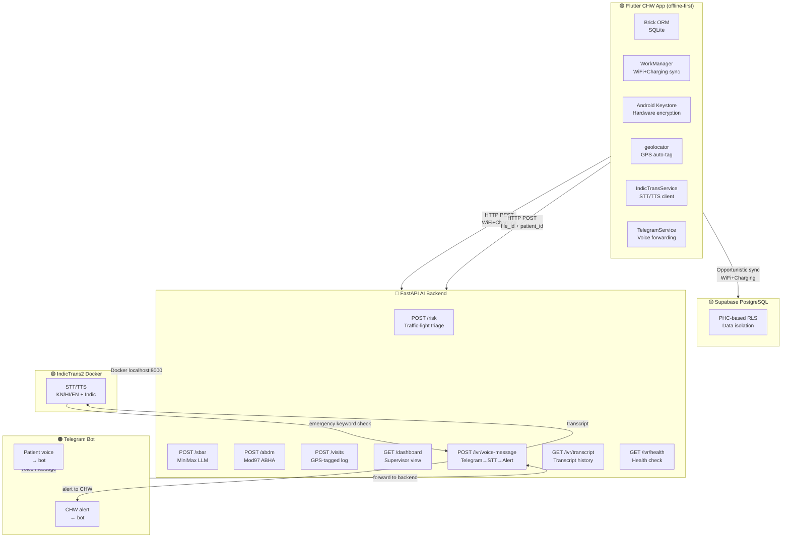
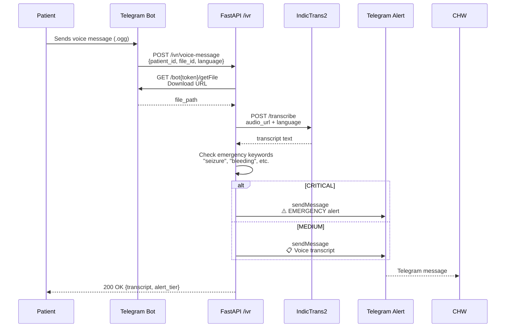
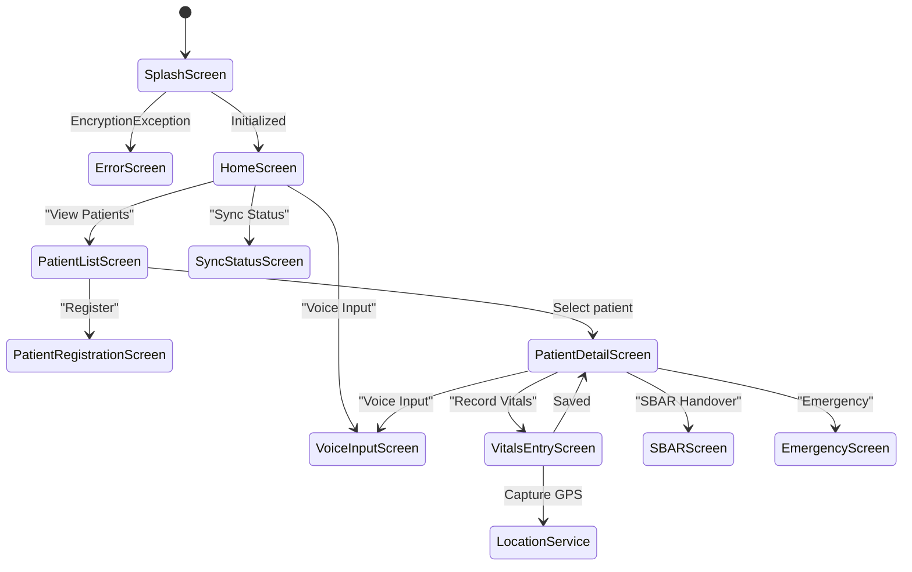
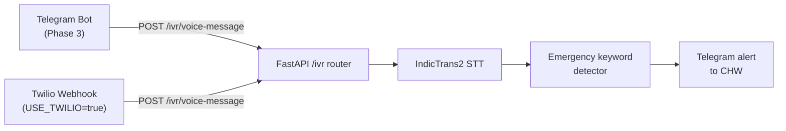

# O2 Platform — Architecture

> Last updated: 2026-05-11 — Phase 3 complete

---

## Overview

**O2 Platform** is an offline-first maternal healthcare monitoring system for Community Health Workers (ASHAs) in rural India. It consists of two deployed artifacts and four supporting systems:

| Component | Technology | Role |
|-----------|-----------|------|
| `apps/o2_app/` | Flutter + Brick ORM | CHW mobile app — offline-first, SQLCipher encrypted |
| `apps/o2_backend/` | FastAPI (Python) | AI server — risk triage, SBAR generation, IVR |
| `ivr_backend/` | Twilio webhooks (Phase 1) | Missed-call IVR for feature-phone patients |
| `supabase/` | PostgreSQL + RLS | Optional cloud sync with PHC-based data isolation |
| `docs/` | Markdown | Strategy, plans, requirements, solutions |

---

## System Architecture

### Mermaid — Full System Overview



### ASCII — Full System Overview

```
┌─────────────────────────────────────────────────────────────────────┐
│  Flutter CHW App (offline-first, SQLCipher encrypted)              │
│                                                               │
│  Brick ORM (local SQLite) ←→ FHIR R4 models                   │
│  WorkManager (WiFi + Charging sync)                             │
│  Android Keystore (hardware-backed encryption key)               │
│  geolocator (GPS auto-tag on vitals)                          │
│  IndicTransService (STT/TTS, self-hosted Docker)               │
│  TelegramService (voice forwarding to IVR backend)              │
└───────────────────────┬─────────────────────────────────────────┘
                          │ HTTP REST (WiFi + Charging)
                          ▼
┌─────────────────────────────────────────────────────────────────┐
│  FastAPI AI Backend (Python)                  apps/o2_backend/  │
│                                                                 │
│  POST /risk         → Traffic-light triage (WHO thresholds)    │
│  POST /sbar         → SBAR handover document (MiniMax LLM)    │
│  POST /abdm         → ABHA ID validation (Mod 97 checksum)     │
│  POST /visits       → Visit log with GPS coordinates          │
│  GET  /dashboard    → Supervisor dashboard                      │
│  POST /ivr/voice-message → Telegram voice → IndicTrans2 STT   │
│  GET  /ivr/transcript/{id} → Patient transcript history        │
│  GET  /ivr/health   → IVR + IndicTrans2 health check         │
└───────────────────────┬─────────────────────────────────────────┘
                          │ Docker localhost:8000
                          ▼
┌─────────────────────────────────────────────────────────────────┐
│  IndicTrans2 Docker Container                                   │
│  Self-hosted STT/TTS for Kannada, Hindi, English + Indic    │
│  Serves both FastAPI backend and Flutter voice widget          │
└─────────────────────────────────────────────────────────────────┘

┌─────────────────────────────────────────────────────────────────┐
│  Telegram Bot (@YourBot) — Patient IVR channel                  │
│                                                                 │
│  Patient sends voice message → bot forwards to /ivr/voice      │
│  Backend transcribes → emergency keyword check → Telegram alert  │
│  to assigned CHW                                           │
└─────────────────────────────────────────────────────────────────┘

┌─────────────────────────────────────────────────────────────────┐
│  ivr_backend/ (Phase 1 — legacy Twilio)                        │
│  /twilio/missed-call → patient_lookup → WhatsAppSender        │
│  Active when USE_TWILIO=true with real Twilio credentials   │
└─────────────────────────────────────────────────────────────────┘

┌─────────────────────────────────────────────────────────────────┐
│  Supabase PostgreSQL (optional cloud sync)                     │
│  PHC-based Row Level Security                                 │
│  Tables: phc_hierarchy, chw_assignments, patients,           │
│          vitals_logs, clinical_contact_logs, sbar_documents   │
└─────────────────────────────────────────────────────────────────┘
```

### Mermaid — IVR Voice Pipeline (Phase 3)



### Mermaid — Flutter App State Flow



---

## Key Design Decisions

### Offline-First (Brick ORM + SQLCipher)
Patient data lives locally first. Sync only triggers when:
- Network: WiFi connected (`NetworkType.unmetered`)
- Battery: Device is charging (`requiresCharging: true`)

This prevents bill shock on expensive rural data plans and battery drain during home visits.

### FHIR R4 Everywhere
India's National Health Stack uses FHIR R4. By making FHIR the canonical format in app models, API payloads, and database — we eliminate translation layers and can plug into government systems directly.

| App Model | FHIR Resource |
|-----------|---------------|
| `Patient` | `FHIR Patient` |
| `Vitals` | `FHIR Observation` |
| `SBAR` | `FHIR DocumentReference` |

### Telegram Bot IVR (Phase 3 — replaces Twilio)
Patient sends voice via Telegram → `/ivr/voice-message` → IndicTrans2 STT → emergency detection → Telegram alert to CHW. No Twilio credentials needed for demo. `USE_TWILIO=true` env var re-activates Twilio adapter when real credentials arrive.

### Adapter Pattern for IVR



All pieces are swappable — Twilio↔Telegram, IndicTrans2↔Bhashini, SQLite↔Supabase.

### GPS Auto-Tag (NHM Compliance)
Every vitals record captures `locationLat`/`locationLng` at record time via `geolocator` package. Location is displayed in a card before save, so CHW sees exactly what was recorded.

### SBAR + MiniMax LLM
CHW fills Situation/Background/Assessment/Recommendation → POST `/sbar` → MiniMax returns formatted SBAR document → shareable as text or PDF.

---

## Directory Structure

```
AAVISHKAR-PRAVAH/
├── apps/
│   ├── o2_app/                      # Flutter CHW app
│   │   └── lib/
│   │       ├── core/
│   │       │   ├── constants.dart    # API URLs, tokens, config
│   │       │   ├── router.dart       # GoRouter + all screen widgets
│   │       │   └── theme.dart        # O2Theme (primary #6B21A8)
│   │       ├── models/
│   │       │   ├── patient.dart      # FHIR Patient
│   │       │   ├── vitals.dart       # FHIR Observation
│   │       │   └── clinical_contact.dart
│   │       ├── repositories/
│   │       │   ├── patient_repository.dart  # Brick offline-first
│   │       │   └── vitals_repository.dart
│   │       └── services/
│   │           ├── location_service.dart    # GPS via geolocator
│   │           ├── telegram_service.dart   # Bot → IVR backend
│   │           ├── indictrans_service.dart # STT/TTS client
│   │           ├── sync_service.dart       # WorkManager background sync
│   │           ├── encryption_service.dart # SQLCipher + Android Keystore
│   │           └── fhir_serializer.dart
│   │   └── pubspec.yaml
│   └── o2_backend/                  # FastAPI AI server
│       ├── main.py                  # FastAPI app, CORS, all routers
│       ├── routers/
│       │   ├── risk.py              # /risk — traffic-light triage
│       │   ├── sbar.py              # /sbar — SBAR LLM generation
│       │   ├── abdm.py              # /abdm — ABHA validation
│       │   ├── visits.py            # /visits — GPS-tagged visit log
│       │   ├── dashboard.py          # /dashboard — supervisor view
│       │   └── ivr.py              # /ivr — Telegram voice IVR (Phase 3)
│       ├── services/
│       │   ├── abha_generator.py    # Mod 97 ABHA checksum
│       │   ├── indictrans.py         # IndicTrans2 STT/TTS Docker client
│       │   ├── telegram_alerts.py    # Telegram bot sendMessage
│       │   ├── database.py          # SQLite patient repo
│       │   ├── ml_risk_scorer.py   # XGBoost shadow (Phase 4)
│       │   ├── risk_model.py        # WHO threshold rules
│       │   └── sbar_llm.py         # MiniMax API client
│       └── requirements.txt
├── ivr_backend/                    # Phase 1 Twilio legacy
│   ├── main.py                    # Twilio webhook endpoints
│   ├── patient_lookup.py
│   ├── whatsapp_sender.py
│   └── emergency_detector.py
├── supabase/
│   ├── schema.sql                 # PostgreSQL schema
│   └── rls_policies.sql          # PHC-based Row Level Security
├── docs/
│   ├── architecture.md            # This file
│   ├── STRATEGY.md              # Product strategy
│   ├── ideation/                 # ce-ideate output
│   ├── brainstorms/              # ce-brainstorm requirements
│   ├── plans/                   # ce-plan implementation plans
│   └── solutions/                # ce-compound learnings
└── pitch.md                      # Investor pitch deck
```

---

## API Contracts

### Risk Triage — `POST /risk`
```json
// Request
{ "systolic": 140, "diastolic": 90, "hb": 9.5, "temp": 99.5, "weight": 58, "lmp_weeks": 32 }

// Response
{ "tier": "HIGH", "score": 73, "recommendations": ["Refer to PHC within 24h"] }
```

### SBAR Generation — `POST /sbar`
```json
// Request
{ "patient_id": "...", "situation": "...", "background": "...", "assessment": "...", "recommendation": "..." }

// Response
{ "sbar_document": "📋 SBAR HANDOFF\n🔴 SITUATION: ...", "generated_at": "2026-05-11T..." }
```

### IVR Voice Message — `POST /ivr/voice-message`
```json
// Request
{ "patient_id": "...", "file_id": "<telegram_file_id>", "language": "kn" }

// Response
{ "transcript": "...", "alert_tier": "EMERGENCY|MEDIUM|LOW", "is_critical": true, "patient_name": "..." }
```

### ABHA Validation — `POST /abdm`
```json
// Request
{ "abha_id": "12-3456-7890-1234" }

// Response
{ "valid": true, "checksum_ok": true }
```

---

## Tech Stack Summary

| Layer | Technology | Version |
|-------|-----------|---------|
| Mobile app | Flutter | 3.x |
| State management | Riverpod | 2.x |
| Navigation | GoRouter | 14.x |
| Offline data | Brick ORM + SQLCipher | latest |
| Background sync | WorkManager | 0.5.x |
| AI backend | FastAPI | 0.115.x |
| ML inference | XGBoost (Phase 4) | 2.x |
| Voice STT/TTS | IndicTrans2 Docker | latest |
| IVR (Phase 1) | Twilio | v3 |
| IVR (Phase 3) | Telegram Bot API | v1 |
| AI generation | MiniMax API | v1 |
| Database (cloud) | Supabase PostgreSQL + RLS | latest |

---

## Deployment

### FastAPI Backend
```bash
cd apps/o2_backend
pip install -r requirements.txt
cp .env.example .env  # fill in TELEGRAM_BOT_TOKEN, MINIMAX_API_KEY
uvicorn apps.o2_backend.main:app --reload --port 8000
```

### IndicTrans2 Docker
```bash
docker run -p 8000:8000 \
  -e MODEL_ID=ai4bharat/indictrans-en-indic-1B \
  indictrans:server
```

### Flutter App
```bash
cd apps/o2_app
flutter pub get
flutter run  # connects to http://10.0.2.2:8000 (Android emulator)
```

---

## Phase Roadmap

| Phase | Status | Key Deliverables |
|-------|--------|-----------------|
| Phase 1 MVP | ✅ Complete | Flutter app, FastAPI, Twilio IVR, ABDM mock |
| Phase 2 Local APIs | ✅ Complete | Mod97 ABHA, IndicTrans2 Docker, Telegram Bot, XGBoost shadow |
| Phase 3 Full Wiring | ✅ Complete | Telegram IVR pipeline, complete Flutter UI, GPS auto-tag, MiniMax AI |
| Phase 4 On-Device ML | 🔜 Next | Quantized XGBoost for offline risk inference |

---

## Phase 4 — On-Device ML (Quantized XGBoost)

Phase 4 adds offline ML inference so risk scoring works without any network connectivity.

### What to Build

| Item | Description |
|------|-------------|
| **Quantized XGBoost model** | Convert trained XGBoost model to ONNX or TensorFlow Lite for mobile CPU inference |
| **Flutter XGBoost inference** | `xgboost_inference` package or ONNX runtime on Flutter — `RiskScorer` class |
| **Offline risk API** | `POST /offline/risk` in Flutter that calls local model when backend unreachable |
| **Sync-then-predict** | When online: use FastAPI `/risk`. When offline: use local quantized model |
| **Model versioning** | Ship model with app bundle, update via Supabase storage when online |

### Key Decisions

- **Quantization**: INT8 quantization reduces model size ~75% (40MB → 10MB) with <2% accuracy loss
- **ONNX Runtime**: Runs on Android CPU, no GPU required, works offline
- **Model delivery**: Bundle quantized `.onnx` in Flutter assets; update from Supabase storage when online
- **Fallback chain**: Online → FastAPI `/risk`. Offline → local ONNX model. Unknown → WHO threshold rules

### Steps

1. Train XGBoost on historical patient data (needs Supabase data first)
2. Export to ONNX format with `xgboost.to_onnx()`
3. Quantize to INT8 with ONNX quantization tools
4. Add `onnxruntime_flutter` package to `pubspec.yaml`
5. Create `lib/services/risk_scorer_offline.dart`
6. Add `POST /offline/risk` inference route in Flutter
7. Update `VitalsEntryScreen` to use offline scorer when `SyncService` is offline

### Demo Strategy

**Demo now (Phase 3) is better than waiting for Phase 4** because:

1. **Phase 3 proves the full data flow** — registration → vitals → GPS → risk triage → SBAR → IVR alert — all without Phase 4 ML
2. **WHO threshold rules are already functional** — risk scoring in `/risk` uses deterministic rules, not ML
3. **Quantized XGBoost improves accuracy, not correctness** — the ML model learns from Phase 3 real-world data to improve risk calibration, but the WHO rules already catch true emergencies
4. **Phase 4 benefits from Phase 3 data** — every patient registered and vitals recorded in Phase 3 becomes training data for the Phase 4 model

**Recommended demo sequence:**
- Demo 1 (now, Phase 3): Full Flutter app flow + IVR Telegram pipeline + GPS on vitals
- Demo 2 (after Phase 4): Same demo but risk scoring now uses quantized on-device model with improved calibration from real Phase 3 data

### Demo Test Checklist (Phase 3 — do now)

```
□ Start IndicTrans2 Docker on port 8000
□ Start FastAPI: uvicorn apps.o2_backend.main:app --reload
□ Start Telegram Bot webhook (configure @BotFather bot)
□ flutter run on Android emulator (connects to 10.0.2.2:8000)
□ Register 2 patients (normal + high-risk scenario)
□ Record vitals with GPS auto-capture
□ Test /risk endpoint with sample vitals
□ Test /sbar endpoint with sample SBAR form
□ Send test voice via Telegram bot → verify transcript
□ Verify GPS coordinates appear on vitals card
□ Check Flutter console for any crash/errors
□ Run flutter analyze for linting issues
```
