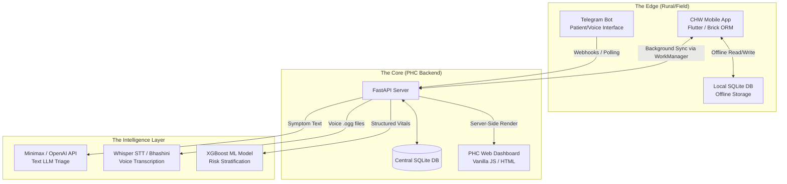
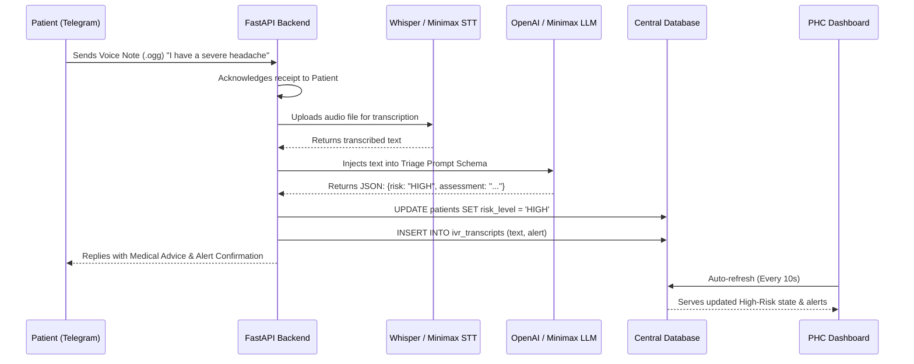

# O₂ Platform: System Architecture

The O₂ platform uses a hybrid, offline-first architecture designed for high resilience in low-connectivity rural environments. It combines an edge-capable mobile application (Flutter) with a centralized, AI-driven FastAPI backend.

---

## 1. High-Level Architecture Flow

The system is divided into three primary zones: **The Edge (Field)**, **The Core (Backend)**, and **The Intelligence Layer (AI Services)**.



### How the High-Level Flow Works
1. **The Edge:** Community Health Workers use the Flutter app. Because of the `Brick ORM`, all reads and writes hit the **Local SQLite DB** first, ensuring zero latency and 100% offline capability.
2. **The Sync:** When the phone detects an internet connection, a background `WorkManager` job pushes the local changes to the **FastAPI Server**.
3. **The Intelligence:** If a patient sends a voice note via **Telegram**, the FastAPI server downloads the audio, sends it to the **STT API** (Whisper/Bhashini), gets the text, and feeds it to the **Text LLM** for triage.
4. **The Core:** The Fast API server stores all results in the **Central SQLite DB** and instantly serves the updated state to the **PHC Web Dashboard**.

---

## 2. AI Triage & Voice Pipeline

This diagram explains the specific technical flow of how unstructured voice data becomes a structured medical alert on the PHC dashboard.



### How the AI Pipeline Works
- **Format Handling:** Telegram sends voice notes in `.ogg` format. The backend handles temporary file storage and streams the binary data to the transcription API.
- **Strict JSON Enforcement:** The LLM is heavily prompted to return *only* a strictly formatted JSON object (Risk Level, Assessment, Patient Message). This prevents hallucinated conversational text from breaking the backend parsing logic.
- **State Mutation:** The backend parses the JSON. If the risk is elevated (HIGH/EMERGENCY), it directly mutates the patient's state in the central database. Because the dashboard continuously polls the FastAPI endpoints (`/api/summary`), the visual state updates in near real-time without requiring complex WebSockets.

---

## 3. Offline-First Synchronization Strategy

The mobile application relies on the `brick_offline_first` paradigm. 

```mermaid
graph LR
    subgraph "Flutter Mobile App"
        UI[UI Layer / Riverpod]
        Repo[Brick Repository]
        Local[(SQLite)]
        Queue[Offline Queue]
    end
    
    subgraph "Cloud / Backend"
        API[REST API / Supabase]
    end

    UI -->|1. Request Data| Repo
    Repo -->|2. Fetch from Cache| Local
    Local -->> UI: 3. Instant Render (Offline)
    
    UI -->|4. Save Vital Sign| Repo
    Repo -->|5. Write to DB| Local
    Repo -->|6. Add to Queue| Queue
    
    Queue -.->|7. Wait for Network| Queue
    Queue -->|8. Sync when Online| API
```

### How Offline Sync Works
1. **Local-First Truth:** The UI *never* waits for a network response. When a CHW saves a patient's blood pressure, Riverpod updates the UI immediately based on the successful write to the local SQLite database.
2. **Mutation Queue:** Brick creates a serialized request object in an offline queue. 
3. **Background Processing:** A persistent background worker monitors network connectivity. When a connection is established, it flushes the queue sequentially to the FastAPI REST endpoints. If a request fails (e.g., 500 error), it remains in the queue for exponential backoff retry.
