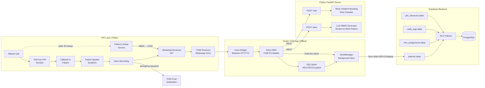
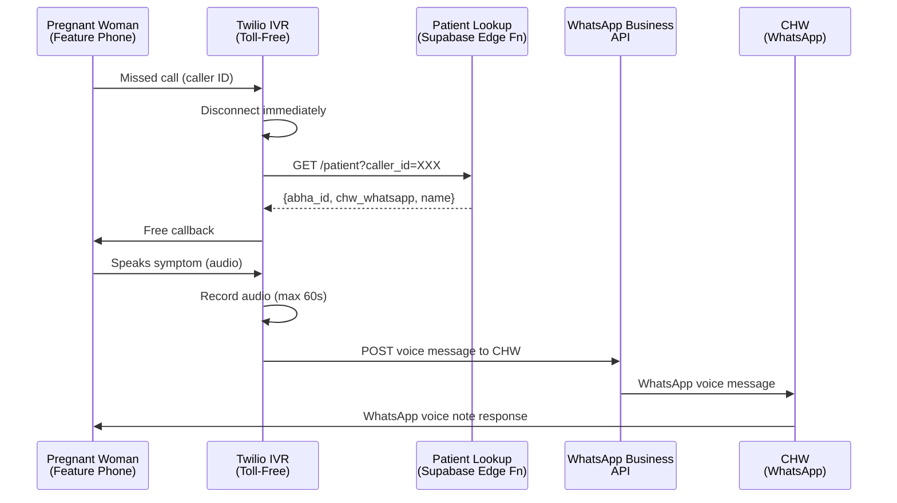

# O2 Platform Phase 1 — Implementation Plan

## Summary

This plan delivers the Phase 1 (24-hour hackathon) MVP of the O2 Platform: an offline-first maternal healthcare monitoring application for Community Health Workers in rural India. The implementation spans three deployment surfaces — a Flutter mobile app (CHW Interface), a Python FastAPI AI server (Risk Assessment + SBAR Generation), and an IVR backend service (Patient Communication Layer) — all backed by Supabase PostgreSQL with Row-Level Security. The Flutter app stores patient data in FHIR R4 format locally using Brick ORM + SQLCipher, syncs opportunistically via WorkManager, provides voice-driven I/O via Bhashini STT/TTS, and exposes clinical AI decisions (risk scoring, SBAR documents) that work fully offline.

---

## Problem Frame

Rural maternal healthcare collapses at the last-mile connection between pregnant women and the health system. CHWs lose visibility between scheduled visits; patients with feature phones cannot reach their CHW; clinical decisions require connectivity that the field does not have; and patient data is siloed across systems. O2 addresses this by building an offline-first clinical tool for CHWs and a zero-cost, zero-app communication bridge for patients — both feeding into a shared data layer that enables AI-driven risk assessment.

**Origin:** `docs/brainstorms/O2-IVR-Communication-Layer-requirements.md` (IVR Communication Layer); `STRATEGY.md` (full product strategy)

---

## Assumptions

*This plan was authored without synchronous user confirmation on all technical decisions below. Each is an inferred bet that should be reviewed before implementation proceeds.*

- Twilio will be the IVR platform for Phase 1 (Exotel is an alternative; choice does not materially affect the API contract design)
- WhatsApp Business API will be used to forward voice recordings from IVR to CHW's WhatsApp number
- Bhashini plugin v1.x will be available and functional for STT/TTS in Kannada and Hindi at hackathon time
- The Python FastAPI server will be deployed as a separate service (not embedded in Flutter)
- Supabase project will be provisioned before implementation begins
- Flutter v3.22+ with Dart 3.4+ will be used (confirm SDK constraint before U1 begins)

---

## Requirements

- R1. CHW can register a patient, record vitals, and receive a risk score — all without network connectivity
- R2. Patient data is encrypted at rest (AES-256 via SQLCipher) with the encryption key stored in Android Keystore
- R3. Local data syncs to Supabase when WiFi + charging conditions are met (WorkManager)
- R4. FHIR R4-compliant JSON serialization is available for all patient/vitals entities
- R5. CHW can input symptoms via voice (Kannada/Hindi STT) and receive risk scores and SBAR summaries via TTS playback
- R6. Risk assessment endpoint accepts patient vitals and returns Low / Medium / High / Emergency
- R7. SBAR generation endpoint accepts longitudinal patient data and returns a structured JSON SBAR document
- R8. Supabase RLS policies restrict CHW read/write access to patients registered to their assigned PHC only
- R9. Patient can give a missed call to a toll-free number, receive a free callback, speak a symptom, and the CHW receives it as a WhatsApp voice message
- R10. IVR system identifies the patient via caller ID → ABHA mapping (no keypad input required from patient)
- R11. Emergency keyword detection during IVR recording triggers immediate CHW call and PHC escalation
- R12. ABDM-compliant mock REST service provides stub implementations for HPR verification, HFR linking, and ABHA ID validation

**Origin actors:** Pregnant Woman / Rural Family Member (A1), Community Health Worker / ASHA (A2), PHC Supervisor / Block Health Officer (A3)  
**Origin flows:** F1 (Patient Initiates Contact: Missed Call → Callback → Voice Message), F2 (CHW Responds via WhatsApp Voice Note), F3 (Emergency Detection and Escalation)  
**Origin acceptance examples:** AE1 (Missed-call-to-voice-delivery latency < 90s), AE2 (IVR callback completion rate > 95%), AE3 (CHW response rate > 80% within 24h)

---

## Scope Boundaries

- No on-device quantized ML model — cloud AI used for Phase 1 risk scoring and SBAR generation
- No real Twilio/Exotel IVR integration in Phase 1 — IVR platform stubbed with documented API contracts
- No official WhatsApp Business API provisioning — voice forwarding stubbed at the API contract level
- No multi-language beyond Kannada and Hindi
- No GPS check-in enforcement (GPS coordinates captured but not yet enforced as visit prerequisite)
- No two-way real-time voice call between patient and CHW
- No live ABDM API calls — all ABDM endpoints are mocks with documented contracts

### Deferred to Follow-Up Work

- **On-device ML inference** (Phase 2): quantized Gradient Boosting / Random Forest model running locally on Android — eliminates cloud dependency for clinical decisions
- **WhatsApp Business API official provisioning** (Phase 2): production WhatsApp Business API account and number provisioning
- **Real IVR integration** (Phase 2): production Twilio/Exotel account, IVR flow deployment, telco partnership
- **Multi-language expansion** (Phase 2+): Bengali, Marathi, and other regional languages
- **GPS check-in enforcement** (Phase 2): GPS coordinate capture becomes mandatory before vitals entry is accepted
- **Cloud-backed key management service** (Phase 2): SQLCipher key recovery survives device reset

---

## Context & Research

### Relevant Code and Patterns

This is a greenfield project. No existing code patterns to follow — implementation draws from:

- Brick ORM `offline_first` architecture — `brick_offline_first_with_supabase` package
- FHIR R4 resource shapes — `Patient`, `Observation`, `Condition`, `DocumentReference` (from `fhir` package)
- SQLCipher Android integration — `sqflite_sqlcipher` + Android Keystore patterns
- WorkManager `ExistingPeriodicWorkPolicy.KEEP` for background sync scheduling
- Supabase PostgreSQL RLS policy patterns — `auth.uid()` + PHC hierarchy join
- Twilio IVR webhook patterns — `answer`, `gather`, `record` verbs
- Python FastAPI dependency injection + background tasks patterns

### External References

- FHIR R4 Specification: https://www.hl7.org/fhir/R4/
- Brick Offline First: https://github.com/rightapps-leftbrains/brick_offline_first_with_supabase
- Supabase RLS: https://supabase.com/docs/guides/auth/row-level-security
- Twilio IVR Webhook Guide: https://www.twilio.com/docs/voice/twiml
- Bhashini STT/TTS API: https://bhashini.gov.in/

---

## Key Technical Decisions

- **FHIR R4 native models in Brick**: All local patient/vitals entities are defined as FHIR R4 resources using the `fhir` Dart package. Brick adapters serialize/deserialize FHIR-compliant JSON. Eliminates translation layers between local storage, sync wire format, and external ecosystem integration. See `U1` for details.
- **SQLCipher + Android Keystore for PHI at rest**: Encryption key is generated via `AndroidKeyStore` (hardware-backed Titan M or equivalent), never stored on disk in plaintext. Key lifecycle (rotation, recovery) deferred to Phase 2.
- **WorkManager sync on WiFi + charging only**: Prevents battery depletion during home visit rounds on solar-powered devices. `NetworkType.UNMETERED` + `Constraint.ENERGY_CHARGING` as hard constraints.
- **Cloud AI for Phase 1, on-device for Phase 2**: Risk scoring and SBAR generation run on the Python FastAPI server during hackathon. Phase 2 replaces with quantized on-device ML model.
- **IVR platform as a service layer (Twilio)**: IVR logic (missed call detection, callback, recording) is hosted on Twilio Voice Platform. Webhook callbacks POST to O2's backend. WhatsApp Business API forwards audio to CHW. The Patient Lookup Service is a Supabase-hosted REST endpoint.
- **Single Supabase project for all data**: Supabase hosts PostgreSQL (patients, vitals_logs, chw_assignments, phc_hierarchy), Auth (CHW OTP-based), and the Patient Lookup Service REST endpoint. Brick sync adapter communicates with Supabase Remote.
- **ABDM mock as structured stubs**: A Dart `AbdmService` class provides mock implementations with documented ABDM-compliant request/response shapes. No live API calls until Phase 2.

---

## Open Questions

### Resolved During Planning

- **Flutter state management**: Riverpod (flutter_riverpod) — lightweight, testable, works offline-first with Brick
- **Conflict resolution strategy**: Last-Write-Wins with clinical-hierarchy override (PHC-reported vitals override self-reported)
- **IVR language for prompts**: ElevenLabs TTS generates regional language prompts (Kannada for Karnataka deployment, Hindi for Uttar Pradesh)
- **Patient Lookup Service**: Implemented as a Supabase Edge Function + REST endpoint; maps caller ID → patient ABHA → CHW WhatsApp number

### Deferred to Implementation

- **Bhashini API authentication**: Will be resolved during U5 when voice widget integration begins
- **WhatsApp Business API rate limits**: Will be characterized during U4 when IVR backend is stubbed
- **Exact FHIR DocumentReference SBAR schema**: Will be finalized during U3 when SBAR generation endpoint is implemented
- **WorkManager periodic sync interval**: Will be tuned during U1 based on device battery profiling

---

## Output Structure

```
aavishkar_pravah/
├── STRATEGY.md
├── docs/
│   ├── ideation/
│   │   └── O2-Platform-ideation.md
│   ├── brainstorms/
│   │   └── O2-IVR-Communication-Layer-requirements.md
│   └── plans/
│       └── 2026-05-11-001-feat-o2-platform-phase1-plan.md   ← this plan
├── apps/
│   └── o2_app/                          # Flutter CHW application
│       ├── pubspec.yaml
│       ├── lib/
│       │   ├── main.dart
│       │   ├── app.dart
│       │   ├── core/
│       │   │   ├── constants.dart
│       │   │   ├── theme.dart
│       │   │   └── router.dart
│       │   ├── models/                  # Brick + FHIR models
│       │   │   ├── patient.dart
│       │   │   ├── vitals.dart
│       │   │   ├── clinical_contact.dart
│       │   │   └── brick.g.dart         # generated
│       │   ├── repositories/
│       │   │   ├── patient_repository.dart
│       │   │   └── vitals_repository.dart
│       │   ├── services/
│       │   │   ├── sync_service.dart    # WorkManager + Brick sync
│       │   │   ├── encryption_service.dart  # SQLCipher + Keystore
│       │   │   ├── fhir_serializer.dart  # FHIR R4 JSON helpers
│       │   │   ├── risk_assessment_service.dart  # calls FastAPI
│       │   │   ├── sbar_service.dart     # calls FastAPI
│       │   │   └── voice_service.dart    # Bhashini STT/TTS
│       │   ├── voice/
│       │   │   └── voice_input_widget.dart  # Bhashini STT/TTS widget
│       │   ├── ivr/
│       │   │   └── ivr_message_handler.dart  # processes IVR webhook payloads
│       │   └── abdm/
│       │       └── abdm_service.dart     # ABDM mock REST client
│       └── android/
│           └── app/src/main/kotlin/.../
│               └── keystore_generator.dart  # Android Keystore key gen
├── backend/
│   ├── requirements.txt
│   ├── main.py
│   ├── routers/
│   │   ├── __init__.py
│   │   ├── risk.py          # Risk assessment endpoint
│   │   └── sbar.py          # SBAR generation endpoint
│   ├── services/
│   │   ├── __init__.py
│   │   ├── risk_model.py    # Mock ML model (Gradient Boosting sim)
│   │   └── sbar_llm.py      # LLM integration for SBAR
│   └── models/
│       ├── __init__.py
│       ├── vitals_input.py
│       └── sbar_output.py
├── supabase/
│   ├── schema.sql           # PostgreSQL schema
│   └── rls_policies.sql    # Row-Level Security policies
└── ivr_backend/
    ├── requirements.txt
    ├── main.py             # Twilio webhook server (stubbed)
    ├── patient_lookup.py   # Supabase Edge Function REST client
    └── whatsapp_sender.py # WhatsApp Business API stub
```

---

## High-Level Technical Design

> *This illustrates the intended approach and is directional guidance for review, not implementation specification. The implementing agent should treat it as context, not code to reproduce.*

### System Architecture



### Data Flow: Patient Initiates Contact via IVR



---

## Implementation Units

### U1. Flutter CHW App Foundation — Brick + FHIR + SQLCipher + WorkManager

**Goal:** Establish the offline-first Flutter app foundation: Brick ORM with FHIR R4 models, SQLCipher encryption at rest, and WorkManager background sync.

**Requirements:** R1, R2, R3, R4

**Dependencies:** External: Supabase project must be provisioned; Flutter SDK v3.22+ confirmed

**Files:**
- Create: `apps/o2_app/pubspec.yaml`
- Create: `apps/o2_app/lib/models/patient.dart`
- Create: `apps/o2_app/lib/models/vitals.dart`
- Create: `apps/o2_app/lib/models/clinical_contact.dart`
- Create: `apps/o2_app/lib/repositories/patient_repository.dart`
- Create: `apps/o2_app/lib/repositories/vitals_repository.dart`
- Create: `apps/o2_app/lib/services/encryption_service.dart`
- Create: `apps/o2_app/lib/services/sync_service.dart`
- Create: `apps/o2_app/lib/services/fhir_serializer.dart`
- Create: `apps/o2_app/lib/core/constants.dart`
- Create: `apps/o2_app/lib/app.dart`
- Create: `apps/o2_app/android/app/src/main/kotlin/.../keystore_generator.dart`
- Create: `apps/o2_app/test/encryption_service_test.dart`
- Create: `apps/o2_app/test/patient_repository_test.dart`

**Approach:**
- Define `Patient` as a Brick model annotated with `@ConnectOfflineFirstWithSupabase` — backed by FHIR R4 `Patient` resource using the `fhir` package. All fields map to FHIR elements.
- Define `Vitals` as a Brick model backed by FHIR R4 `Observation` resource. Each vital sign (BP, weight, Hb, temperature) is a separate `Observation` resource within the Bundle.
- `EncryptionService` wraps `sqflite_sqlcipher`. On first launch, generates an AES-256 key via `AndroidKeyStore`, stores it in Keystore. `EncryptionService.getKey()` retrieves it on each db open.
- `SyncService` wraps `WorkManager`. Registers a periodic sync work with `ExistingPeriodicWorkPolicy.KEEP`, constraints `NetworkType.UNMETERED` + `Constraint.ENERGY_CHARGING`. Sync interval: 15 minutes.
- `PatientRepository` and `VitalsRepository` expose async methods (`getPatient`, `saveVitals`, etc.) that Brick resolves to local sqflite when offline, Supabase Remote when online.
- `FhirSerializer` provides `toFhirJson()` and `fromFhirJson()` helpers for `Patient` and `Vitals` → FHIR R4 Bundle serialization.

**Execution note:** Start with Brick model definitions and the Brick-generated adapter files (`*.g.dart`). Build `EncryptionService` and `SyncService` against the Brick adapter interface. Add Supabase remote configuration last.

**Technical design:** *(directional guidance — not implementation spec)*
```dart
// Patient model — FHIR R4 native
@ConnectOfflineFirstWithSupabase(
  remoteName: 'patients',
  localName: 'patients',
  fields: [...],
  fromFirestore: Patient.fromFhirMap,
  toFirestore: Patient.toFhirMap,
)
class Patient {
  final String id;           // FHIR id
  final String abhaId;       // ABHA number
  final String name;
  final int age;
  final String gender;
  final String phoneNumber;
  final String assignedChwId;
  final String phcId;
  // ...
}

// Encryption key from Android Keystore
Future<Uint8List> getSqlCipherKey() async {
  final ks = AndroidKeyStore('O2KeyStore');
  final entry = await ks.getEntry('o2_sqlcipher_key');
  return entry.bytes; // AES-256 key
}
```

**Patterns to follow:**
- Brick `offline_first` repository pattern with `@ConnectOfflineFirstWithSupabase` annotation
- SQLCipher + Android Keystore integration from `sqflite_sqlcipher` documentation
- WorkManager periodic task registration from Android Jetpack WorkManager documentation

**Test scenarios:**
- Happy path: `PatientRepository.save(patient)` persists to local SQLCipher db; `PatientRepository.getPatient(id)` retrieves it — both work offline
- Happy path: `SyncService` triggers sync when WiFi + charging conditions are met; data appears in Supabase
- Edge case: SQLCipher key retrieval fails (Keystore entry corrupted) — app logs error and shows user-facing "Data unavailable" screen; does not crash
- Edge case: Sync triggered but Supabase is unreachable — Brick retries with exponential backoff; sync completes on next trigger cycle
- Error path: Invalid FHIR data written to local db — `FhirSerializer` validation throws `FormatException` before commit
- Integration: Full CRUD cycle (register patient → record vitals → risk score → SBAR) works without any network connectivity

**Verification:**
- App loads without network; patient CRUD operations complete in < 5 seconds locally
- SQLCipher db file on disk is unreadable without the Keystore key
- WorkManager sync job is registered and fires when constraints are met

---

### U2. Supabase PostgreSQL Schema with RLS Policies

**Goal:** Create the PostgreSQL schema (patients, vitals_logs, chw_assignments, phc_hierarchy) and RLS policies enforcing that CHWs can only access patients registered to their assigned PHC.

**Requirements:** R8

**Dependencies:** U1 (Flutter app foundation must be started to confirm field names and FHIR mapping)

**Files:**
- Create: `supabase/schema.sql`
- Create: `supabase/rls_policies.sql`
- Modify: `apps/o2_app/pubspec.yaml` (add Supabase Dart client dependency)
- Create: `apps/o2_app/lib/services/supabase_client.dart` (Brick Supabase adapter configuration)
- Create: `supabase/test_rls.sql` (manual RLS verification queries)

**Approach:**
- `schema.sql` creates tables matching Brick model field names:
  - `patients(id, abha_id, name, age, gender, phone_number, assigned_chw_id, phc_id, created_at, updated_at)`
  - `vitals_logs(id, patient_id, vital_type, value, unit, recorded_by, recorded_at, source)`
  - `chw_assignments(chw_id, phc_id, active, assigned_at)`
  - `phc_hierarchy(id, name, parent_phc_id, block_id, district_id)`
- `phc_hierarchy` is the source of truth for geographic assignment. RLS policies join `patients` → `chw_assignments` → `phc_hierarchy` to enforce access.
- `RLS policy (patients)`: `auth.uid()` joined to `chw_assignments` → filtered to `patients.phc_id IN (SELECT phc_id FROM chw_assignments WHERE chw_id = auth.uid() AND active = true)`
- `RLS policy (vitals_logs)`: same PHC filter applied via `vitals_logs.patient_id` → `patients.phc_id`
- `RLS policy (chw_assignments)`: `auth.uid()` can only SELECT their own row
- Brick sync adapter configured to map Supabase table names to Brick model adapters

**Technical design:** *(directional guidance)*
```sql
-- PHC hierarchy self-referential table
CREATE TABLE phc_hierarchy (
  id UUID PRIMARY KEY DEFAULT gen_random_uuid(),
  name TEXT NOT NULL,
  parent_phc_id UUID REFERENCES phc_hierarchy(id),
  block_id TEXT,
  district_id TEXT,
  created_at TIMESTAMPTZ DEFAULT now()
);

-- Patients table
CREATE TABLE patients (
  id UUID PRIMARY KEY DEFAULT gen_random_uuid(),
  abha_id TEXT UNIQUE NOT NULL,
  name TEXT NOT NULL,
  age INTEGER,
  gender TEXT CHECK (gender IN ('M', 'F', 'O')),
  phone_number TEXT,
  assigned_chw_id UUID REFERENCES auth.users(id),
  phc_id UUID REFERENCES phc_hierarchy(id),
  created_at TIMESTAMPTZ DEFAULT now(),
  updated_at TIMESTAMPTZ DEFAULT now()
);

-- RLS policies
ALTER TABLE patients ENABLE ROW LEVEL SECURITY;

CREATE POLICY patients_phc_isolation ON patients
  USING (
    assigned_chw_id = auth.uid()
    OR EXISTS (
      SELECT 1 FROM chw_assignments ca
      WHERE ca.chw_id = auth.uid()
        AND ca.active = true
        AND ca.phc_id = patients.phc_id
    )
  );

ALTER TABLE vitals_logs ENABLE ROW LEVEL SECURITY;

CREATE POLICY vitals_logs_phc_isolation ON vitals_logs
  USING (
    EXISTS (
      SELECT 1 FROM patients p
      WHERE p.id = vitals_logs.patient_id
        AND (
          p.assigned_chw_id = auth.uid()
          OR EXISTS (
            SELECT 1 FROM chw_assignments ca
            WHERE ca.chw_id = auth.uid()
              AND ca.active = true
              AND ca.phc_id = p.phc_id
          )
        )
    )
  );
```

**Patterns to follow:**
- Supabase RLS policy patterns from Supabase documentation
- Brick `offline_first_with_supabase` adapter configuration pattern

**Test scenarios:**
- Happy path: CHW-A (PHC-A assigned) creates a patient in PHC-A → patient appears for CHW-A; CHW-B (PHC-B assigned) cannot see CHW-A's patient
- Happy path: CHW reassigned from PHC-A to PHC-B → RLS automatically reflects new assignment (next login)
- Edge case: Patient has no assigned PHC (`phc_id IS NULL`) → RLS denies all access until PHC is assigned
- Error path: RLS policy misconfigured — Supabase returns 403; Brick sync logs error and retries; no silent data leakage
- Integration: Patient created offline in Flutter app → synced to Supabase when online → same patient visible in Supabase dashboard for assigned CHW only

**Verification:**
- Supabase dashboard shows correct row counts per PHC after test data load
- Cross-CHW access attempts return 403 in Supabase dashboard

---

### U3. Python FastAPI Server — Risk Assessment + SBAR Generation

**Goal:** Deploy a Python FastAPI server with two endpoints: `POST /risk` (accepts vitals, returns risk score) and `POST /sbar` (accepts longitudinal patient data, returns structured SBAR JSON using LLM).

**Requirements:** R6, R7

**Dependencies:** External: OpenAI API key or Claude API key for LLM access; FastAPI deployment environment (local or cloud)

**Files:**
- Create: `backend/requirements.txt`
- Create: `backend/main.py`
- Create: `backend/routers/__init__.py`
- Create: `backend/routers/risk.py`
- Create: `backend/routers/sbar.py`
- Create: `backend/services/__init__.py`
- Create: `backend/services/risk_model.py`
- Create: `backend/services/sbar_llm.py`
- Create: `backend/models/__init__.py`
- Create: `backend/models/vitals_input.py`
- Create: `backend/models/sbar_output.py`
- Create: `backend/tests/test_risk.py`
- Create: `backend/tests/test_sbar.py`

**Approach:**
- `main.py` bootstraps FastAPI app with CORS (allow Flutter app origin), mounts `/risk` and `/sbar` routers.
- `POST /risk` accepts `VitalsInput` (patient_id, vital_type, value, unit, recorded_at). `RiskModelService` simulates a Gradient Boosting model using a rule-based scoring heuristic for Phase 1 (real ML model deferred to Phase 2). Returns `{"risk_level": "Low" | "Medium" | "High" | "Emergency", "confidence": 0.XX, "flagged_factors": [...]}`. Risk levels mapped to traffic-light triage (Red=Emergency, Yellow=Medium/High, Green=Low).
- `POST /sbar` accepts longitudinal patient data (FHIR Bundle or array of Observations). `SbarLlmService` prompts the LLM with a strict "Section-to-Meta Summarization" pattern: the prompt defines the SBAR schema explicitly and instructs the LLM to output only valid JSON matching that schema. System prompt includes adversarial input guardrails. Returns `SBAROutput` Pydantic model.
- SBAR schema:
  ```json
  {
    "situation": "Brief statement of the patient's current status",
    "background": "Relevant clinical history and context",
    "assessment": "Clinical impression and risk level with justification",
    "recommendation": "Specific, actionable next steps for the receiving facility"
  }
  ```
- API key authenticated via `X-API-Key` header. Keys stored in environment variables.

**Technical design:** *(directional guidance)*
```python
# risk_model.py — Phase 1 mock (rule-based)
def predict_risk(vitals: VitalsInput) -> RiskOutput:
    score = 0
    if vitals.vital_type == "blood_pressure":
        systolic = int(vitals.value.split("/")[0])
        if systolic > 160:
            score += 3
        elif systolic > 140:
            score += 2
        elif systolic > 120:
            score += 1
    # ... similar for Hb, weight, temperature
    risk = map_score_to_risk(score)  # 0-1=Low, 2-3=Medium, 4-5=High, 6+=Emergency
    return RiskOutput(risk_level=risk, confidence=0.85, flagged_factors=[...])

# sbar_llm.py — LLM with strict schema enforcement
SBAR_SYSTEM_PROMPT = """You are a clinical referral document generator.
Generate ONLY valid JSON matching this exact schema:
{
  "situation": string (max 200 chars),
  "background": string (max 500 chars),
  "assessment": string (max 500 chars),
  "recommendation": string (max 300 chars)
}
Do not include any text outside the JSON object.
Do not use markdown code blocks.
"""
```

**Patterns to follow:**
- FastAPI dependency injection pattern for service classes
- Pydantic request/response models
- LLM API integration pattern (OpenAI `openai` python package or Anthropic `anthropic` python package)

**Test scenarios:**
- Happy path: `POST /risk` with valid vitals returns risk level within expected latency (< 500ms)
- Happy path: `POST /sbar` with full longitudinal data returns well-formed SBAR JSON matching the schema
- Edge case: Vitals values are extreme outliers (systolic 300 mmHg) — server returns Emergency without crashing
- Edge case: SBAR prompt is empty (no longitudinal data) — LLM returns SBAR with "Insufficient data" in situation field
- Error path: LLM API returns non-JSON response — server catches exception, returns 502 with `{"error": "LLM returned invalid format"}`
- Error path: API key is missing or invalid — server returns 401
- Integration: SBAR output includes patient's recent vitals trends extracted from longitudinal data

**Verification:**
- `POST /risk` returns valid `RiskOutput` JSON for all vital types in the schema
- `POST /sbar` returns valid SBAR JSON with all four sections present and non-empty
- FastAPI server starts without errors; health check endpoint responds at `/health`

---

### U4. IVR Backend Service — Patient Lookup + WhatsApp Voice Forwarding

**Goal:** Build the IVR backend service stub (Twilio webhook handler, Patient Lookup Service client, WhatsApp Business API sender) with documented API contracts for Phase 2 real integration.

**Requirements:** R9, R10, R11

**Dependencies:** U2 (Patient Lookup Service requires Supabase schema); External: Twilio account (mock), WhatsApp Business API (mock)

**Files:**
- Create: `ivr_backend/requirements.txt`
- Create: `ivr_backend/main.py`
- Create: `ivr_backend/patient_lookup.py`
- Create: `ivr_backend/whatsapp_sender.py`
- Create: `ivr_backend/emergency_detector.py`  # keyword detection stub
- Create: `ivr_backend/tests/test_ivr_flow.py`
- Create: `ivr_backend/tests/test_patient_lookup.py`

**Approach:**
- `main.py` is a minimal FastAPI app acting as the Twilio webhook receiver. Two endpoints:
  - `POST /twilio/missed-call` — receives Twilio `StatusCallback` event; queries Patient Lookup Service; initiates callback if caller is registered
  - `POST /twilio/voice-recording` — receives Twilio recording webhook; runs emergency keyword detection; forwards audio to WhatsApp Business API
- `PatientLookupService` is a REST client to the Supabase Edge Function that maps `caller_id` → `{abha_id, chw_whatsapp_number, patient_name}`.
- `WhatsAppSender` is a stub for the WhatsApp Business API `messages` endpoint — logs the outgoing payload for Phase 1; returns a mock `message_sid`. Real integration in Phase 2.
- `EmergencyDetector` runs simple keyword matching on the recorded audio transcript (text input for Phase 1; real speech-to-text deferred to Phase 2). Keywords: blood, pain, unconscious, bleeding, seizure (plus Kannada/Hindi equivalents).
- When emergency keyword is detected: the webhook immediately routes to the CHW (bypasses normal queue) and sends a push notification to the O2 app.

**Technical design:** *(directional guidance)*
```python
# emergency_detector.py — Phase 1 keyword stub
EMERGENCY_KEYWORDS = {
    "en": ["blood", "pain", "unconscious", "bleeding", "seizure"],
    "kn": ["ರಕ್ತ", "ನೋವು", "ವಿಷಾಣ", "ರಕ್ತಸ್ರಾವ", "ಸೆಳೆವು"],
    "hi": ["खून", "दर्द", "बेहोश", "खून आना", "दौरा"],
}

def detect_emergency(transcribed_text: str) -> bool:
    text_lower = transcribed_text.lower()
    for lang, keywords in EMERGENCY_KEYWORDS.items():
        if any(kw in text_lower for kw in keywords):
            return True
    return False
```

**Patterns to follow:**
- Twilio Voice webhook pattern (`StatusCallback`, `RecordingCallback`)
- FastAPI dependency injection for service classes
- REST client pattern for Patient Lookup Service

**Test scenarios:**
- Happy path: Missed call from registered patient → callback initiated within 10 seconds
- Happy path: Voice recording with non-emergency symptom → WhatsApp message sent to CHW
- Edge case: Caller ID not found in Patient Lookup Service → IVR plays "Number not registered" message in regional language
- Edge case: WhatsApp Business API returns rate-limit error (429) → webhook returns Twilio 200 (acknowledge); error logged; retry via scheduled task
- Error path: Patient Lookup Service returns 503 → IVR plays "Please try again later" message
- Integration: Missed call → callback → recording → WhatsApp → CHW notification end-to-end flow (mocked)

**Verification:**
- Twilio webhook endpoints respond with valid TwiML within 200ms
- Patient Lookup Service correctly routes caller ID to ABHA → CHW mapping
- Emergency keyword detection returns true within 100ms of transcription

---

### U5. Flutter Voice Widget — Bhashini STT/TTS Integration

**Goal:** Build the Bhashini voice widget for the Flutter app: STT for symptom input (Kannada/Hindi) and TTS for risk score and SBAR playback.

**Requirements:** R5

**Dependencies:** U1 (app foundation must be in place before voice widget can be integrated); External: Bhashini API credentials

**Files:**
- Create: `apps/o2_app/lib/services/voice_service.dart`
- Create: `apps/o2_app/lib/voice/voice_input_widget.dart`
- Create: `apps/o2_app/test/voice_service_test.dart`

**Approach:**
- `VoiceService` wraps the Bhashini plugin. Provides:
  - `startListening()` → begins STT session in the configured language (Kannada or Hindi)
  - `stopListening()` → ends STT session and returns transcribed text
  - `speak(text)` → TTS playback of the given text in configured language
  - `stopSpeaking()` → cancels current TTS playback
- Language selection is a app-level config (stored in SharedPreferences) — set once per deployment region.
- `VoiceInputWidget` is a StatefulWidget that provides the voice input UI:
  - Large microphone button (tap to start listening)
  - Live transcription display as words are recognized
  - Tap again to stop and confirm
  - Read-back confirmation: after STT, TTS reads back the transcription for verification before save
- Radio call-and-response UX: TTS reads back "You said: [transcription]. Say 'yes' to confirm or 'no' to re-record."
- `VoiceService` also handles TTS for risk score and SBAR playback in the review screen.

**Execution note:** Test STT accuracy with rural dialect audio samples before committing to this pattern. If Bhashini accuracy is insufficient for the specific dialect, fall back to typed input with voice enhancement.

**Patterns to follow:**
- Bhashini plugin STT/TTS API usage
- Riverpod state management for voice session state
- Flutter `StatefulWidget` for microphone button with gesture handlers

**Test scenarios:**
- Happy path: CHW taps mic, speaks symptom in Kannada, transcription appears in real time, tap to confirm
- Happy path: Risk score is displayed → CHW taps "Listen" → TTS reads score in Kannada
- Edge case: STT returns empty string (silence or unintelligible audio) → widget shows "Please speak again" message; does not save empty string
- Edge case: Bhashini API is unreachable — widget shows "Voice unavailable, please type" fallback; app remains functional
- Error path: TTS playback interrupted by incoming call — playback pauses and resumes when call ends; no crash
- Integration: Voice input → confirmed transcription → saved as vitals → risk score generated → TTS playback of score → all work offline

**Verification:**
- Voice widget renders in the vitals entry screen
- STT transcription completes within 5 seconds for a typical symptom sentence
- TTS playback is audible at default volume on mid-range Android device

---

### U6. ABDM Mock Service — Dart REST Client with Compliant Contracts

**Goal:** Build the `AbdmService` Dart class that provides mock implementations for ABDM ecosystem integration (HPR verification, HFR linking, ABHA ID validation) with documented ABDM-compliant request/response shapes.

**Requirements:** R12

**Dependencies:** U1 (app foundation)

**Files:**
- Create: `apps/o2_app/lib/abdm/abdm_service.dart`
- Create: `apps/o2_app/test/abdm_service_test.dart`

**Approach:**
- `AbdmService` is a Dart class with three methods:
  - `verifyHpr(workerId)` → returns `HprVerificationResult` (mock: always returns `verified: true` for Phase 1; documents real API shape for Phase 2)
  - `linkHfr(clinicId)` → returns `HfrLinkResult` (mock: always returns `linked: true`; documents real API shape for Phase 2)
  - `validateAbhaId(abhaId)` → returns `AbhaValidationResult` (mock: validates checksum digit algorithm locally; documents real API shape for Phase 2)
- Each method has a clearly documented ABDM API contract comment:
  - Request shape (URL, method, headers, body)
  - Response shape (success and error codes)
  - ABDM reference: which ABDM API spec this corresponds to
- Mock implementations log the request and return a hardcoded successful response with the documented shape.
- Phase 2 will replace mock implementations with real HTTP calls to ABDM APIs.

**Patterns to follow:**
- Dart service class pattern (similar to `EncryptionService`, `SyncService`)
- Repository pattern for external service integration with clear interfaces

**Test scenarios:**
- Happy path: `AbdmService.verifyHpr("HPR-12345")` returns `HprVerificationResult(verified: true, name: "Test Worker")` without network
- Happy path: `AbdmService.validateAbhaId("12-3456-6789-1234")` validates checksum → returns valid; `AbhaId("12-3456-6789-1235")` (wrong checksum) → returns invalid
- Edge case: Malformed ABHA ID passed → `validateAbhaId` returns `valid: false, error: "Invalid format"` without calling any external service
- Error path: If real ABDM API is called in Phase 2 and returns error code → `AbdmService` maps ABDM error codes to user-facing error messages

**Verification:**
- All three methods execute without network (all mock implementations)
- Response shapes match documented ABDM API contracts
- Flutter app compiles and launches with ABDM service initialized

---

## System-Wide Impact

- **Interaction graph:** The IVR backend (`U4`) must be reachable from Twilio webhooks. The Flutter app (`U1`, `U5`) must call the Python FastAPI server (`U3`) for risk/SBAR. All three systems write to Supabase (`U2`).
- **Error propagation:** If the Python FastAPI server is unreachable, Flutter app's risk/SBAR features degrade gracefully (offline cache if previously loaded, user-facing error if no prior data). IVR backend failure results in Twilio playing an error message; no patient data loss.
- **State lifecycle risks:** Brick sync may produce duplicate patient records if the same patient is registered from two CHWs simultaneously. Mitigated by FHIR id uniqueness + Last-Write-Wins conflict resolver.
- **API surface parity:** Any changes to the FastAPI `/risk` or `/sbar` request/response schema must be communicated to the Flutter app integration team before deployment.
- **Integration coverage:** End-to-end integration test should run: (1) Patient registered in Flutter app, (2) Vitals recorded offline, (3) App comes online, (4) Supabase sync completes, (5) Risk score retrieved from FastAPI, (6) SBAR generated. Manual acceptance test at minimum.
- **Unchanged invariants:** Supabase Auth OTP flow is not modified by this plan. Brick sync adapter remains the only code that writes to Supabase Remote.

---

## Risks & Dependencies

| Risk | Mitigation |
|------|------------|
| Twilio/Exotel IVR access unavailable during hackathon | `U4` is fully stubbed with documented contracts; real integration is Phase 2 |
| Bhashini STT accuracy in rural Kannada/Hindi dialects | Radio call-and-response confirmation provides human verification; typed fallback always available |
| Supabase RLS misconfiguration causes data leakage | Write RLS test suite (`U2`) before deployment; test cross-access denial explicitly |
| SQLCipher key loss on device reset | Remote wipe capability designed in; key recovery service deferred to Phase 2 |
| FastAPI server becomes bottleneck during offline reconnection storm | WorkManager throttles sync jobs; exponential backoff in Brick retry logic |
| WhatsApp Business API rate limiting | `U4` stubs with retry-on-429 logic; Phase 2 will queue messages |

---

## Documentation / Operational Notes

- Flutter app debug APK build: `flutter build apk --debug`
- FastAPI server startup: `uvicorn backend.main:app --reload --port 8000`
- IVR backend startup: `uvicorn ivr_backend.main:app --reload --port 8001`
- Supabase local development: `supabase start`
- A local mock IVR testing tool (Postman collection or a simple Dart test harness) should be created alongside `U4` to simulate Twilio webhook payloads without a live Twilio account

---

## Sources & References

- **Origin document:** [docs/brainstorms/O2-IVR-Communication-Layer-requirements.md](../brainstorms/O2-IVR-Communication-Layer-requirements.md)
- **Product strategy:** [STRATEGY.md](../STRATEGY.md)
- FHIR R4 Specification: https://www.hl7.org/fhir/R4/
- Brick Offline First: https://github.com/rightapps-leftbrains/brick_offline_first_with_supabase
- Supabase RLS: https://supabase.com/docs/guides/auth/row-level-security
- Twilio Voice Webhooks: https://www.twilio.com/docs/voice/twiml
- Bhashini API: https://bhashini.gov.in/
- Android Keystore: https://developer.android.com/training/articles/keystore
